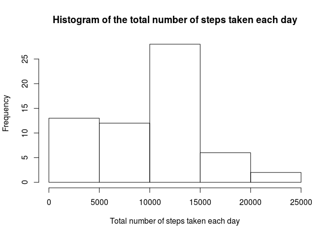
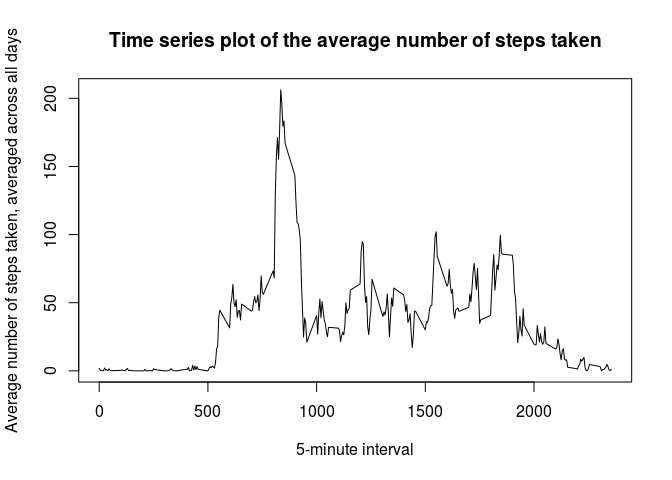
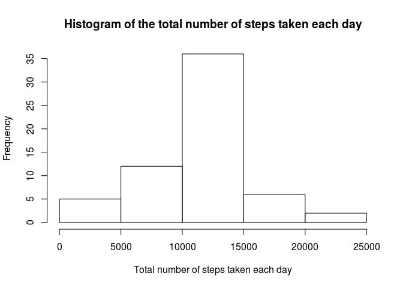
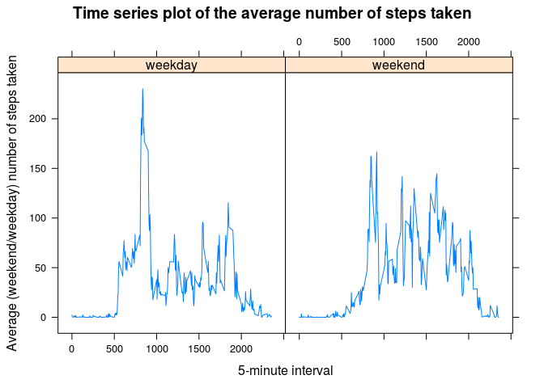

# Reproducible Research: Peer Assessment 1

## Loading and preprocessing the data

1. We load the data using the following code. The data is stored in a (tbl) data frame *activity*.

```r
unzip("./activity.zip")
```

```r
library(dplyr)
activityDF <- read.csv("./activity.csv", colClasses=c("integer","Date","integer"))
activity <- tbl_df(activityDF)
```

## What is mean total number of steps taken per day?

**1. Calculate the total number of steps taken per day**  

```r
total_steps <- sum( activity$steps, na.rm = TRUE )
days <- unique( activity$date )
total_steps_per_day <- total_steps / length( days )
```
Total number of steps (ignoring NA values) for all 61 days is stored in an integer variable *total_steps*.
Days are stored in a Date vector *days*. Total number of steps taken per day is
the total number of steps divided by the number of days: 9354.23.

**2. Make a histogram of the total number of steps taken each day**   
We group the data by *date* and calculate the total number of steps for each day using the *summarize* function. 
The result is stored in an integer vector *total_steps_each_day*. 
Then the histogram of the total number of steps taken each day is plotted. 

```r
by_date <- group_by( activity, date )
total_steps_each_day <- summarize( by_date, sum( steps, na.rm = TRUE ) )[[2]]
hist(total_steps_each_day, 
     main = "Histogram of the total number of steps taken each day", 
     xlab = "Total number of steps taken each day")
```

 


**3. Calculate and report the mean and median of the total number of steps taken per day**  

```r
mean_steps <- mean( total_steps_each_day, na.rm = TRUE )
median_steps <- median( total_steps_each_day, na.rm = TRUE )
```
The mean and median of the total number of steps taken each day is 9354.23 and 10395,
respectively.

## What is the average daily activity pattern?

**1. Make a time series plot (i.e. type = "l") of the 5-minute interval (x-axis) and the average number of steps taken, averaged across all days (y-axis)**   
We group the data by *interval* and calculate the average number of steps for each interval using the *summarize* function. 
The result is stored in a tbl data frame *average_steps_each_interval*. 

```r
by_interval <- group_by( activity, interval )
average_steps_each_interval <- summarize( by_interval, mean( steps, na.rm = TRUE ) )
names(average_steps_each_interval) <- c("interval", "meansteps")
```
There are 288 observations in the *average_steps_each_interval* data frame
with 2 variables, *interval* and *meansteps*.
The code for the time series plot and the plot are shown below. 

```r
plot( average_steps_each_interval$interval, average_steps_each_interval$meansteps, 
      main = "Time series plot of the average number of steps taken", 
      xlab = "5-minute interval",
      ylab = "Average number of steps taken, averaged across all days",
      type = "l" )
```

 


**2. Which 5-minute interval, on average across all the days in the dataset, contains the maximum number of steps?**  

```r
maxsteps_interval <- average_steps_each_interval[ which.max( average_steps_each_interval$meansteps ), 1]
```
We find the observation (row) in the *average_steps_each_interval* data frame that 
corresponds to the maximum (averaged) number of steps. The corresponding interval, *maxsteps_interval*, 
is 835.

## Imputing missing values

**1. Calculate and report the total number of missing values in the dataset (i.e. the total number of rows with NAs)**   

```r
numberNA <- sum( is.na( activity$steps ) )
```
There are 0 missing values in the *interval* variable,
0 missing values in the *date* variable and
2304 missing values in the *steps* variable of the *activity* data frame.

**2. Devise a strategy for filling in all of the missing values in the dataset. The strategy does not need to be sophisticated. For example, you could use the mean/median for that day, or the mean for that 5-minute interval, etc.**   

We replace the missing values in the *activity* dataset by the mean for the 5-minute interval.
*average_steps_each_interval* data frame contains the mean number of steps *meansteps* for each 5-minute *interval*.
We will join the two sets and clean the result.

**3. Create a new dataset that is equal to the original dataset but with the missing data filled in.**   
First, we create a left joined data frame from the *activity* and *average_steps_each_interval* data frames
by variable *interval*,
keeping all the rows in *activity* and adding the *meansteps* variable from the average number of steps for each interval dataset.
Then, we use the *mutate* function to replace the missing *steps* values by the *meansteps* values.
Finally, we clean the dataset so that it only contains variables *steps* (with all the NAs replaced), *date* and *interval*.

```r
activity2 <- left_join( activity, average_steps_each_interval, by = "interval")
activity2 <- mutate( activity2, steps = ifelse( is.na(steps), meansteps, steps) )
activity2 <- select( activity2, steps, date, interval )
```

**4. Make a histogram of the total number of steps taken each day and calculate and report the mean and median total number 
of steps taken per day. Do these values differ from the estimates from the first part of the assignment? 
What is the impact of imputing missing data on the estimates of the total daily number of steps?**   
We group the data by *date* and calculate the total number of steps for each day using the *summarize* function. 
The result is stored in an integer vector *total_steps_each_day2*. 
The histogram of the total number of steps taken each day is plotted below. 

```r
by_date2 <- group_by( activity2, date )
total_steps_each_day2 <- summarize( by_date2, sum( steps ) )[[2]]
hist(total_steps_each_day2, 
     main = "Histogram of the total number of steps taken each day", 
     xlab = "Total number of steps taken each day")
```

 

```r
mean_steps2 <- round( mean( total_steps_each_day2 ), 2)
median_steps2 <- round( median( total_steps_each_day2 ), 2)
```
The mean and median of the total number of steps taken each day is 1.076619\times 10^{4} and 1.076619\times 10^{4},
respectively.
The results differ from the estimates from the first part of the assignment.
The mean and median of the total number of steps taken per day is greater when the missing values are replaced 
by the interval steps averages.
The impact is most pronounced at small values of the total number of steps taken each day.

## Are there differences in activity patterns between weekdays and weekends?

**1. Create a new factor variable in the dataset with two levels – “weekday” and “weekend” indicating whether a given date is a weekday or weekend day.**   
We create a new factor variable *day* that indicates whether a given date is a weekday or weekend day.

```r
activity2 <- mutate( activity2, 
                     day = as.factor( ifelse( weekdays(date) == "Saturday" | weekdays(date) == "Sunday" , 
                                              "weekend", "weekday") ) )
```

**2. Make a panel plot containing a time series plot (i.e. type = "l") of the 5-minute interval (x-axis) and the average number of steps taken, averaged across all weekday days or weekend days (y-axis).**   
We group the data, *activity2*, by *interval* AND *day* and calculate the average number of steps for each interval 
and (weekend/weekday) day using the *summarize* function. 
The result is stored in a tbl data frame *average_steps_each_interval_day2*.

```r
by_interval_day2 <- group_by( activity2, interval, day )
average_steps_each_interval_day2 <- summarize( by_interval_day2, mean( steps ) )
names(average_steps_each_interval_day2) <- c("interval", "day", "meansteps2")
```
There are 576 observations in the *average_steps_each_interval_day2* data frame
with 3 variables, *interval*, *day* and *meansteps2*.
We plot the average number of steps as a function of the 5-minute interval, *meansteps2 ~ interval*,
separately for weekday and weekend days, using the *xyplot* function.

```r
library(lattice)
xyplot( meansteps2 ~ interval | day, data = average_steps_each_interval_day2, 
      main = "Time series plot of the average number of steps taken", 
      xlab = "5-minute interval",
      ylab = "Average (weekend/weekday) number of steps taken",
      type = "l" )
```

 
